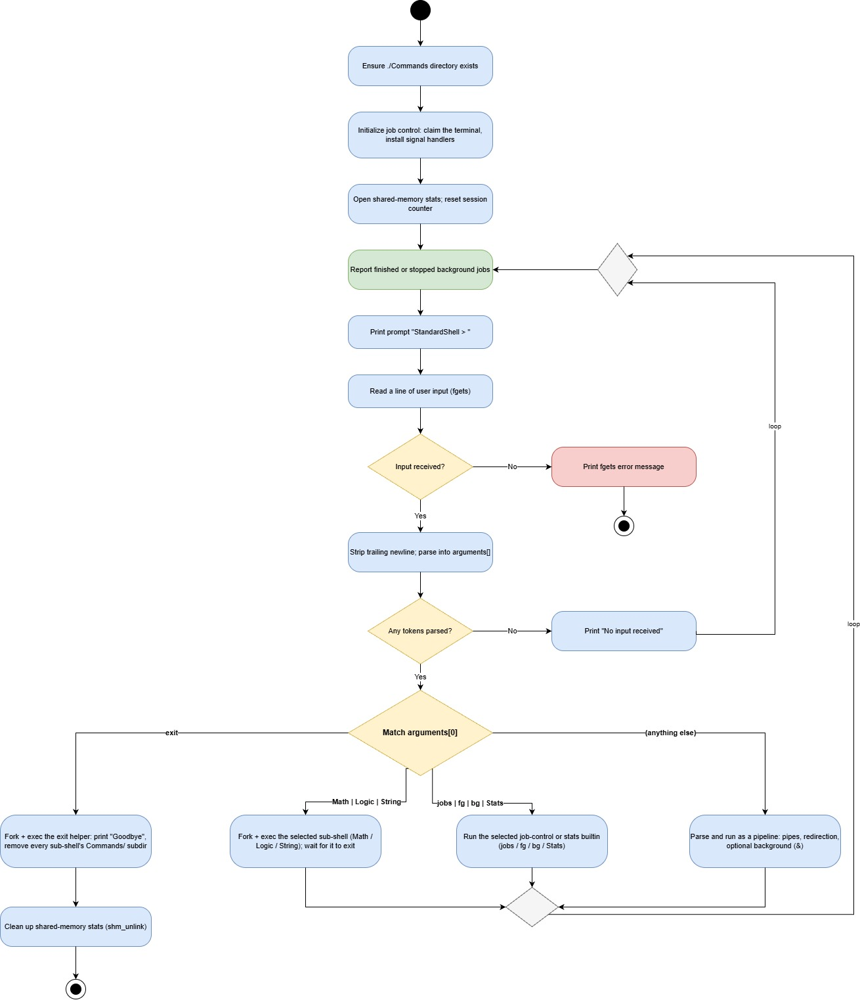

# Custom UNIX Shells

[](https://en.wikipedia.org/wiki/C_(programming_language))
[](https://www.kernel.org/)
[](src/Makefile)
[](LICENSE)

A UNIX shell implemented from scratch in C, built directly on Linux system calls (`fork`, `exec`, `pipe`, `dup2`, `signal`) with **no `system()` call anywhere in the codebase**. It started as a course assignment and has since grown into a small but real shell: four specialized sub-shells, pipelines with I/O redirection, POSIX-style job control (process groups, terminal control, `Ctrl+C`/`Ctrl+Z`), and a cross-process command counter backed by shared memory.

## Table of Contents

- [Features](#features)
- [Architecture](#architecture)
- [Project Structure](#project-structure)
- [Getting Started](#getting-started)
- [Usage](#usage)
- [System Calls Used](#system-calls-used)
- [Known Limitations](#known-limitations)
- [License](#license)

## Features

**Process management**
- Any external Linux command, executed via `fork()`/`execvp()` - no `system()`
- Three specialized sub-shells (`Math`, `Logic`, `String`) launched as child processes, sharing a single command counter with the parent

**Pipelines & redirection**
- Multi-stage pipelines: `ls | grep .c | wc -l` (up to 4 stages)
- Input/output redirection: `sort < names.txt > sorted.txt`, `echo hi >> log.txt`

**Job control**
- Background execution: `sleep 30 &` → `[1] 12345`
- `jobs`, `fg [job_id]`, `bg [job_id]` builtins
- Real process-group-based signal handling: `Ctrl+C` kills the foreground job, `Ctrl+Z` stops it - neither kills the shell itself

**Inter-process communication**
- A command counter (`Stats`) shared across every shell process in the session via POSIX shared memory (`shm_open`/`mmap`), synchronized with a named semaphore

**Per-shell command history**
- Every sub-shell persists its own history to disk with raw `open()`/`write()` syscalls, viewable via its `History` command

## Architecture

The dispatch loop is documented as a UML Activity Diagram, tracing the full control flow from startup through the read-eval-print loop to each builtin dispatch path:



The editable source is [`docs/standard-shell-activity-diagram.drawio`](docs/standard-shell-activity-diagram.drawio) (open with [draw.io](https://app.diagrams.net/) / the VS Code draw.io extension).

At a source level, the project is split into focused modules rather than one large file:

| Module | Responsibility |
|---|---|
| `Standard_shell.c` | REPL loop and builtin dispatch (`exit`, `Math`, `Logic`, `String`, `jobs`, `fg`, `bg`, `Stats`) |
| `jobs.c` / `jobs.h` | Job control: process groups, terminal control, `SIGCHLD` reaping, `jobs`/`fg`/`bg` |
| `pipeline.c` / `pipeline.h` | Pipe/redirection/background parsing and execution for external commands |
| `common/subshell_common.c` / `.h` | Table-driven REPL engine shared by `Math`/`Logic`/`String` |
| `common/ipc_stats.c` / `.h` | The shared-memory command counter |

Each sub-shell (`Math`, `Logic`, `String`) declares only its own command table - name, executable path, required argument count, usage message - and hands it to the shared REPL engine, instead of duplicating the read/parse/dispatch/log loop three times.

## Project Structure

```
src/
├── Standard_shell.c          # Entry point: REPL loop + builtin dispatch
├── jobs.c / jobs.h            # Job control subsystem
├── pipeline.c / pipeline.h    # Pipeline execution
├── shell_config.h             # Shared compile-time limits
├── common/
│   ├── subshell_common.c/.h   # Table-driven REPL engine (Math/Logic/String)
│   └── ipc_stats.c/.h         # Shared-memory command counter
├── functions/
│   ├── Standard_Shell_functions/  # exit, Goodbye, Math, Logic, String
│   ├── Math_Shell_functions/      # Sqrt, Power, Solve, History
│   ├── Logic_Shell_functions/     # DectoBin, DectoHex, Highbit, History
│   └── String_Shell_functions/    # PrintFile, Find, Replace, History
├── Makefile                   # Build rules for all binaries
└── Sys_shell.sh                # Thin wrapper: `make && ./Standard_shell`
docs/
└── standard-shell-activity-diagram.drawio   # UML activity diagram of the dispatch loop
```

## Getting Started

### Prerequisites

- A Linux environment (or a Linux container - this codebase relies on POSIX/glibc extensions such as `killpg()`, `tcsetpgrp()`, and `shm_open()` that aren't available on Windows)
- `gcc` and `make`

### Build

```sh
git clone https://github.com/KoganTheDev/Custom-UNIX-Shells.git
cd Custom-UNIX-Shells/src
make            # builds every binary
```

### Run

```sh
make run        # builds (if needed), then launches Standard_shell
# or, equivalently:
./Standard_shell
```

### Clean

```sh
make clean      # removes all built binaries and the runtime Commands/ directory
```

## Usage

### StandardShell

```sh
StandShell > ls -l
StandShell > ls | grep .c | wc -l
StandShell > echo hello > out.txt
StandShell > sleep 30 &
[1] 24581
StandShell > jobs
[1]+ Running   sleep 30 &
StandShell > Stats
Total commands executed across all shells this session: 6
StandShell > Math
```

| Command | Description |
|---|---|
| `<any command>` | Executed via `fork`/`execvp` (up to 6 arguments) |
| `cmd1 \| cmd2 \| ...` | Pipeline, up to 4 stages |
| `cmd < in`, `cmd > out`, `cmd >> out` | Redirection on the first/last pipeline stage |
| `cmd &` | Run in the background |
| `jobs` | List tracked background jobs |
| `fg [job_id]` / `bg [job_id]` | Resume a job in the foreground/background |
| `Stats` | Print the shared command counter |
| `Math` / `Logic` / `String` | Switch to the corresponding sub-shell |
| `exit` | Print a farewell message and remove every sub-shell's `Commands/` subdirectory |

### MathShell

```sh
MathShell > Sqrt 100
10
MathShell > History
	1. Sqrt 100
MathShell > Cls
StandShell >
```

| Command | Description |
|---|---|
| `Sqrt n` | Square root of `n` |
| `Power x y` | `x^y` |
| `Solve a b c` | Roots of `ax² + bx + c = 0` |
| `History` | Show commands run in this sub-shell |
| `Cls` | Return to `StandShell` |

### LogicShell

| Command | Description |
|---|---|
| `DectoBin n` | Decimal to binary |
| `DectoHex n` | Decimal to hexadecimal |
| `Highbit n` | Count set bits (population count) |
| `History` | Show commands run in this sub-shell |
| `Cls` | Return to `StandShell` |

### StringShell

| Command | Description |
|---|---|
| `PrintFile filename` | Print a file's contents |
| `Find filename string` | Print `WIN` if `string` occurs in the file |
| `Replace "sentence" word pos` | Insert `word` into `sentence` at 1-based position `pos` |
| `History` | Show commands run in this sub-shell |
| `Cls` | Return to `StandShell` |

## System Calls Used

| Category | Calls |
|---|---|
| Process lifecycle | `fork()`, `execlp()`/`execvp()`, `wait()`/`waitpid()` |
| File I/O | `open()`, `read()`, `write()`, `close()`, `lseek()` |
| Pipelines | `pipe()`, `dup2()` |
| Signals | `signal()`, `sigaction()` (`SIGINT`, `SIGTSTP`, `SIGCHLD`, `SIGTTOU`, `SIGTTIN`, `SIGCONT`) |
| Job control | `setpgid()`, `tcsetpgrp()`, `killpg()` |
| IPC | `shm_open()`, `mmap()`, `sem_open()`, `sem_wait()`/`sem_post()` |

## Known Limitations

- Max 6 arguments per command, max 4 pipeline stages (`src/shell_config.h`)
- Foreground pipeline waits don't block `SIGCHLD` during the wait - a simplification, not what a production shell does
- `Math`/`Logic`/`String` are fixed-command REPLs; pipes and redirection are only available in `StandardShell`
- **`Ctrl+C`/`Ctrl+Z` require a real controlling terminal.** If the shell isn't the session leader of an actual TTY - some `docker run` configurations, CI runners, or other nested-terminal setups - `tcsetpgrp()` fails and the shell prints a one-time warning at startup. In that case, foreground jobs won't respond to `Ctrl+C`/`Ctrl+Z`, though `&`, `jobs`, `fg`, and `bg` still work normally. Running with a plain `docker run -it` on a native Linux host (or under WSL2 directly, without Docker in between) gives a full controlling terminal and full signal-based job control.

## License

Licensed under the [MIT License](LICENSE).

## Author

**Yuval Kogan** - [GitHub](https://github.com/KoganTheDev) · [LinkedIn](https://www.linkedin.com/in/yuval-kogan)
